# Redline

A code assist tool that crosses the red line of AI safety

## Agent Context Map

```mermaid
graph TD
    A[Agent Context Map] --> B[Fencer Agents]
    A --> C[Analyst Agents]
    A --> D[Halo Tools]
    A --> E[Shared Context]

    %% Fencer Agents
    B --> B1[Action Execution Tools]
    B --> B2[Observation Tools]
    B --> B3[Memory Tools]

    B1 --> B1_1[Command Execution]
    B1 --> B1_2[System Operations]
    B1 --> B1_3[File Management]
    B1 --> B1_4[Process Control]

    B2 --> B2_1[Real-time Monitoring]
    B2 --> B2_2[State Tracking]
    B2 --> B2_3[Performance Metrics]
    B2 --> B2_4[Error Detection]

    B3 --> B3_1[State Management]
    B3 --> B3_2[Cache Operations]
    B3 --> B3_3[Data Persistence]
    B3 --> B3_4[Resource Tracking]

    %% Analyst Agents
    C --> C1[Analysis Tools]
    C --> C2[Planning Tools]
    C --> C3[Feedback Tools]

    C1 --> C1_1[Code Analysis]
    C1 --> C1_2[Performance Profiling]
    C1 --> C1_3[Pattern Detection]
    C1 --> C1_4[Quality Assessment]

    C2 --> C2_1[Task Decomposition]
    C2 --> C2_2[Resource Planning]
    C2 --> C2_3[Risk Assessment]
    C2 --> C2_4[Strategy Formation]

    C3 --> C3_1[Metrics Collection]
    C3 --> C3_2[Impact Analysis]
    C3 --> C3_3[Trend Detection]
    C3 --> C3_4[Recommendation Engine]

    %% Halo Tools
    D --> D1[Development Tools]
    D --> D2[Integration Tools]
    D --> D3[Security Tools]
    D --> D4[Monitoring Tools]

    D1 --> D1_1[Version Control]
    D1 --> D1_2[Build Systems]
    D1 --> D1_3[Testing Frameworks]
    D1 --> D1_4[Deployment Tools]

    D2 --> D2_1[API Connectors]
    D2 --> D2_2[Data Pipelines]
    D2 --> D2_3[Service Mesh]
    D2 --> D2_4[Message Brokers]

    D3 --> D3_1[Authentication]
    D3 --> D3_2[Authorization]
    D3 --> D3_3[Encryption]
    D3 --> D3_4[Audit Logging]

    D4 --> D4_1[Health Checks]
    D4 --> D4_2[Alerting Systems]
    D4 --> D4_3[Metrics Dashboard]
    D4 --> D4_4[Log Aggregation]

    %% Shared Context
    E --> E1[Communication]
    E --> E2[Resource Management]
    E --> E3[Error Handling]
    E --> E4[Coordination]

    E1 --> E1_1[Message Passing]
    E1 --> E1_2[Event Broadcasting]
    E1 --> E1_3[State Synchronization]
    E1 --> E1_4[Protocol Handling]

    E2 --> E2_1[Memory Allocation]
    E2 --> E2_2[CPU Scheduling]
    E2 --> E2_3[Network Resources]
    E2 --> E2_4[Storage Management]

    E3 --> E3_1[Exception Management]
    E3 --> E3_2[Recovery Procedures]
    E3 --> E3_3[Fallback Mechanisms]
    E3 --> E3_4[Circuit Breaking]

    E4 --> E4_1[Service Discovery]
    E4 --> E4_2[Load Balancing]
    E4 --> E4_3[Task Distribution]
    E4 --> E4_4[State Replication]

    %% Style
    classDef default fill:#f9f9f9,stroke:#333,stroke-width:2px;
    classDef highlight fill:#e1f5fe,stroke:#01579b,stroke-width:2px;
    class B,C,D,E highlight;
```

## Architecture

The system is built around specialized agents that operate with different contexts and tool sets:

### Fencer Agents
- Focus on direct system interactions
- Execute commands and monitor results
- Manage real-time state and resources

### Analyst Agents
- Perform strategic analysis
- Plan and optimize operations
- Provide recommendations and insights

### Halo Tools
Shared infrastructure providing:
- Development and deployment capabilities
- Security and monitoring
- Integration and coordination

### Shared Context
Common ground for all agents including:
- Communication protocols
- Resource management
- Error handling
- Coordination mechanisms

## Documentation

- [Implementation Plan](IMPLEMENTATION_PLAN.md)
- [Gap Analysis](GAP_ANALYSIS.md)
- [Charter](CHARTER.MD)
