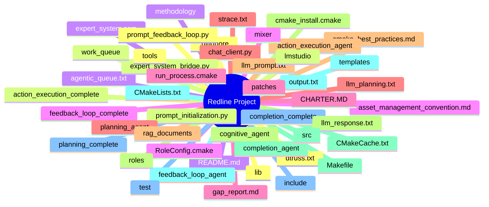

# Factory Floor Layout

```mermaid
mindmap
  root((Redline Project))
    .gitignore
    action_execution_complete
    agentic_queue.txt
    asset_management_convention.md
    CHARTER.MD
    chat_client.py
    cmake_best_practices.md
    cmake_install.cmake
    CMakeCache.txt
    CMakeLists.txt
    completion_complete
    dtruss.txt
    expert_system_bridge.py
    expert_system.scm
    feedback_loop_complete
    gap_report.md
    llm_planning.txt
    llm_prompt.txt
    llm_response.txt
    Makefile
    output.txt
    planning_complete
    prompt_feedback_loop.py
    prompt_initialization.py
    README.md
    RoleConfig.cmake
    run_process.cmake
    strace.txt
    action_execution_agent
    cognitive_agent
    completion_agent
    feedback_loop_agent
    include
    lib
    lmstudio
    methodology
    mixer
    patches
    planning_agent
    rag_documents
    roles
    src
    templates
    test
    tools
    work_queue
```
